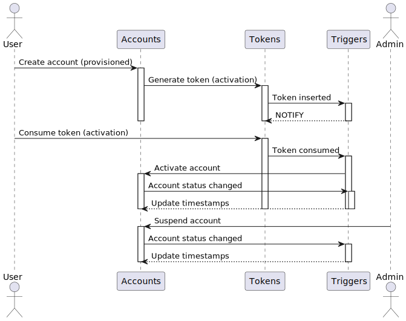

# mailroom

mailroom demonstrates an event-driven architecture that uses PostgreSQL [triggers](https://www.postgresql.org/docs/current/sql-createtrigger.html) and [notifications](https://www.postgresql.org/docs/current/sql-notify.html) to detect account status changes and batch email notifications based on configurable size and time thresholds.

The system is composed of two components:

* [collector](./collector) is a C program that uses libpq to listen for PostgreSQL notifications and produce batches of email payload data.
* [sender](./sender) is a Rust service that consumes the collector's output and sends bulk emails via AWS SES.

There's no external queue; the database itself also serves as a simple self-managed job queue. For details, see [SCHEMA.md](./SCHEMA.md).

## Quickstart

1. Clone this repository.
2. Set up PostgreSQL and apply the provided database migrations.
3. Compile the `collector` by installing `openssl@3` and `libpq@5`, then running `make release`.
4. (Optional) Build the `sender` using `cargo build --release`.
5. Configure the required environment variables and start both components: `./collector | ./sender`.

## How it works?

Actors:

- **User**: Responsible for creating and activating accounts.
- **Admin**: Can suspend accounts.

Components include:

- **Accounts**: A table for storing users and their lifecycle states.
- **Tokens**: A table for managing activation and recovery tokens.
- **Triggers**: Automate processes like status updates, notifications, and timestamp modifications.

Here's the sequence diagram:



- When a token is inserted into the `tokens` table, it includes details such as the action type, a unique secret, and an optional code.
- A PostgreSQL trigger sends a `NOTIFY` event for each newly inserted token.
- The `collector` subscribes to this channel and processes the corresponding rows.

### Collector

The `collector` subscribes to a PostgreSQL notification channel, tracks incoming events, and executes a query when either a row limit (based on the number of received notifications) or a timeout is reached. The results are output as line-delimited batches to stdout, formatted as comma-separated values in the following order:

```
action,email,username,secret,code
```

This schema is repeated for each row in the batch, all included in a single line.

- **`action`**: Numeric representation of the email action type (e.g., `1` for activation, `2` for password recovery).
- **`email`**: Recipient's email address.
- **`username`**: Recipient's login name.
- **`secret`**: A base64 URL-encoded string containing the signed token.
- **`code`**: Optional numeric code (e.g., for password recovery).

##### Example

Here, the first line contains a batch of three actions, including both password recovery and account activation actions. The second line contains a single action for account activation.

```
2,john.doe123@fakemail.test,johndoe,0WEKrnjY_sTEqogrR6qsp7r7Vg4SQ_0iM_1La5hHp5p31nbkrHUBS0Cz9T24iBDCk6CFqO7tJTihpsOVuHYgLg,35866,1,jane.smith456@notreal.example,janesmith,BfQXx31qfY2IJFTtzAp21IdeW0dDIxUT1Ejf3tYJDukNsfaxxOfldwL-lEfVy4SEkZ_v18rf-EWsvWXH5qgvIg,24735,1,emma.jones789@madeup.mail,emmajones,jxrR5p72UWTQ8JiU2DrqjZ-K8L4t8i454S9NtPkVn4-1-bin3ediP0zHMDQU2J_iIyzH4XmNtzpXZhjV0n5xcA,25416
1,sarah.connor999@unreal.mail,resistance1234,zwhCIthd12DqpQSGB57S9Ky-OXV_8H0e8aHOv_kWoggIuAZ2sc-aQVpIoQ-M--PjwVfdIIxiXkv_WjRjGI57zA,38022
```

### Sender

The `sender` processes batches from the `collector`, groups recipients by action type, and sends templated bulk emails through AWS SES.

```sh
./collector | ./sender
```

## Environment Variables

Both components are fully configured using environment variables. Here's the list, their purposes, and default values:

### collector

| Name                            | Default Value          | Description                                                                |
| ------------------------------- | ---------------------- | -------------------------------------------------------------------------- |
| `MAILROOM_DATABASE_URL`         | **(Required)**         | PostgreSQL connection string.                                              |
| `MAILROOM_SECRET_KEY`           | **(Required)**         | 64-character hexadecimal string used as the secret key for HMAC.           |
| `MAILROOM_CHANNEL_NAME`         | `token_insert`         | Name of the PostgreSQL NOTIFY channel to listen for notifications.         |
| `MAILROOM_QUEUE_NAME`           | `mailroom`             | Name of the PostgreSQL queue or table for storing user actions.            |
| `MAILROOM_HEALTHCHECK_INTERVAL` | `270000` (4.5 minutes) | Interval in milliseconds for health checks on the database connection.     |
| `MAILROOM_BATCH_TIMEOUT`        | `5000` (5 seconds)     | Timeout in milliseconds to wait for accumulating a batch of notifications. |
| `MAILROOM_BATCH_LIMIT`          | `10`                   | Maximum number of items to process in a single batch.                      |

### sender

| Name                       | Default Value       | Description                                                                          |
| -------------------------- | ------------------- | ------------------------------------------------------------------------------------ |
| `MAILROOM_DEBUG`           | `false`             | Enables debug mode, logging requests and responses to stdout without sending emails. |
| `MAILROOM_SES_CONFIG_SET`  | `default`           | Name of the SES configuration set to use for sending emails.                         |
| `MAILROOM_SES_SOURCE`      | `noreply@localhost` | Email address used as the sender.                                                    |
| `MAILROOM_SES_OUTPUT_PATH` | `./output`          | Directory path for saving HTTP responses from SES.                                   |

## Database Migrations

The `migrations` folder contains SQL scripts for initializing the database schema. These scripts are managed using the [`go-migrate`](https://github.com/golang-migrate/migrate) tool.

The initial migration includes:

- Creating tables (`accounts`, `tokens`, `jobs`).
- Defining custom types (e.g., `account_status`, `token_action`, `job_type`).
- Adding triggers for token insertion, account status changes, and token consumption.
- Setting up indexes for improved query performance.

To run the migrations:

```bash
go install -tags 'postgres' github.com/golang-migrate/migrate/v4/cmd/migrate@latest

migrate -database "postgres://localhost:5432/example?sslmode=disable" -path migrations up
```

#### Quick Testing

You can quickly populate the database for testing purposes.

```bash
printf "%.0sINSERT INTO accounts (email, login) VALUES ('user' || md5(random()::text) || '@example.com', 'user' || substr(md5(random()::text), 1, 20));select pg_sleep(0.3);\n" {1..42} | psql "postgres://localhost:5432/example"
```

## Building

### collector

To compile `collector`, ensure you have `openssl@3` and `libpq@5` installed on your system, then use the provided Makefile.

- **Makefile Targets**
  - `release`: Compiles an optimized binary for production use. Default target.
  - `debug`: Compiles a binary with debug symbols for development.
  - `clean`: Removes build artifacts.

### sender

The `sender` is written in Rust and uses the `cargo` build system. Its key dependency is the `aws-sdk-ses` crate, which handles interactions with AWS SES.

**Example:** Build a debug release and run:

```bash
make clean && make debug && \
  (cd sender && cargo build) && \
  MAILROOM_DATABASE_URL="dbname=aegis" \
  MAILROOM_SECRET_KEY='deadbeefdeadbeefdeadbeefdeadbeefdeadbeefdeadbeefdeadbeefdeadbeef' \
    ./collector | \
    MAILROOM_DEBUG=true ./sender/target/debug/sender
```

## Docker

Build image:

```bash
docker build -t mailroom:dev .
```

Run the container:

```bash
docker run -it \
  -e MAILROOM_DATABASE_URL="dbname=example host=host.docker.internal port=5432 user=postgres" \
  -e MAILROOM_SECRET_KEY='deadbeefdeadbeefdeadbeefdeadbeefdeadbeefdeadbeefdeadbeefdeadbeef' \
  --rm \
  --name mailroom \
  --memory=6m \
  mailroom:dev
```
